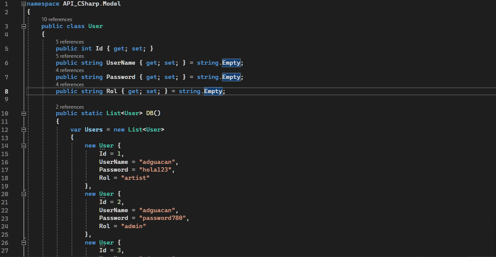
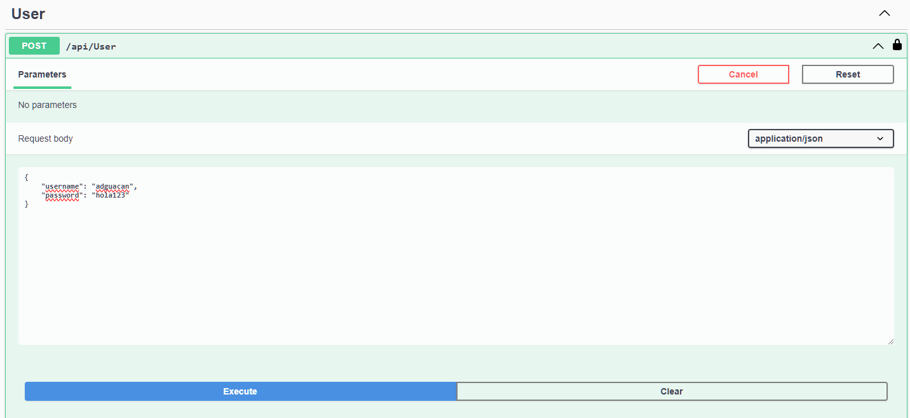
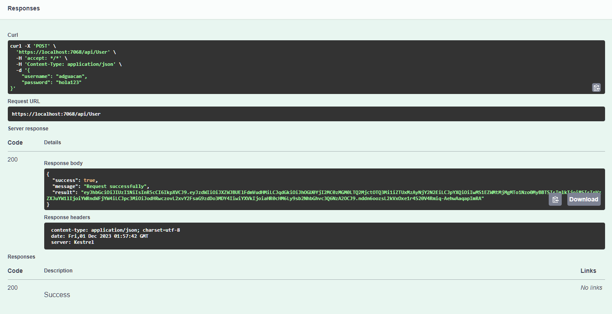
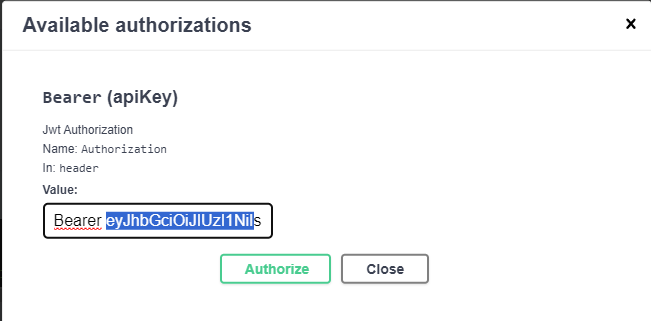
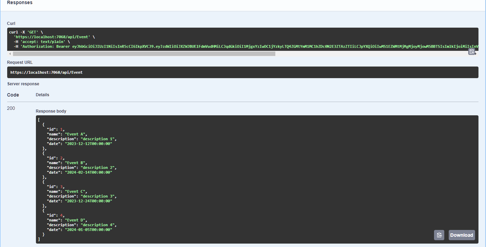
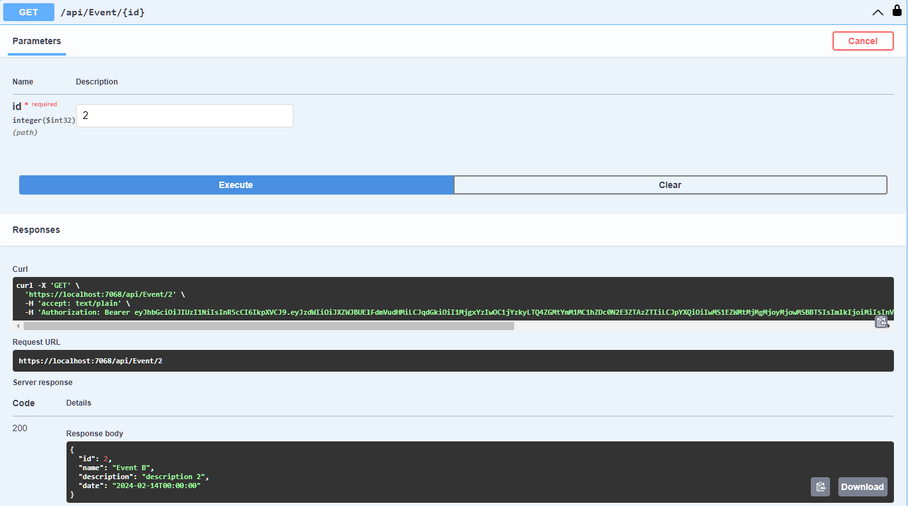
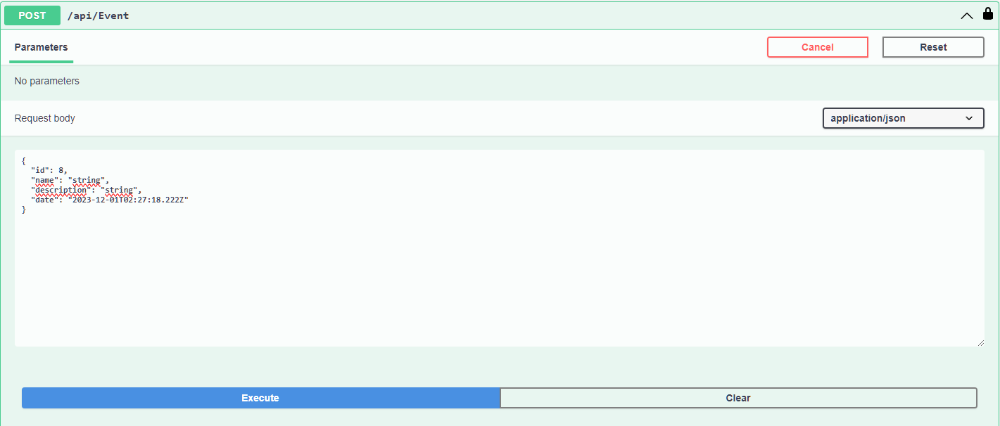
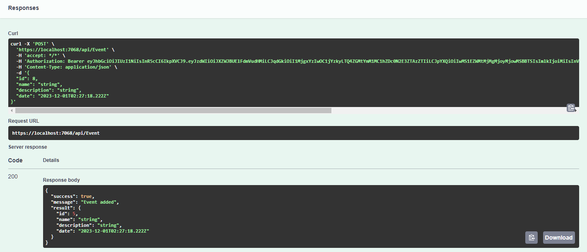
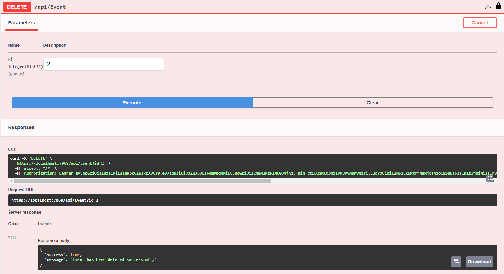

# API EVENTS QUITO

## Requisitos

- Visual Studio 2022
- SDK .NET 7.0

## Instalación

1. Clonar repositorio `https://github.com/Alexander-Guacan/API_CSharp.git` o descargarlo

    

2. Abrir carpeta donde descargo el proyecto y click derecho en el archivo ***ASP_CSharp.sln*** => *Abrir con* => *Visual Studio 2022*

    

## ¿Cómo utilizarlo?

Esta aplicación no cuenta con una conexión real a una base de datos, por lo que los dato otorgados se encuentran plasmados en el código y puede modificarlos a su gusto.

Para empezar a utilizar la API, basta con ejecutar el proyecto desde Visual Studio en el boton ***Start Without Debugging*** o presionando **Ctrl + F5**


Una vez dentro podrá observar dos tipos de controladores, User y Event, estos controladores manejan el inicio de sesión y un CRUD sobre registros de eventos sociales respectivamente.

### USER

Este controlador funciona para como inicio de sesión para un usuario que requiera hacer una petición del controlador CLIENT el cual necesita un Json Web Token (JWT) para poder ejecutarlo.

#### Iniciar sesión

Dado que los usuarios registrados son fijos, puede dirigirse al archivo llamado ***User.cs***, allí encontrará diferentes tipos de usuarios con su nombre de usuario (UserName) y contraseña (Password).



En la API, dirijase a la sección ***User***->***Try it out*** y escriba en *Request body* el objeto Json que contenga la información del usuario con el cual desea iniciar sesión. Por ejemplo:

````js
{
    "username": "user123",
    "password": "password123"
}
````



Luego, de click en ***Execute***. Si el usuario y contraseña fueron las correctas observará más abajo un mensaje de *Response body* donde se desplegará el token con el cual podrá iniciar sesión en la API.



Por último, copie el token generado previamente. De click en el botón ***Authorize*** que se encuentra al principio de la página, se desplegará una ventana emergente con un cuadro de texto, allí deberá escribir la palabra *Bearer* seguido del token y luego de click en ***Authorize***, tal que así:



### EVENT

Para probar cada una de las peticiones siempre deberemos dirigirnos a la sección correspondiente y presionar en el botón ***Try it out***, si la petición requiere el envío de un objeto Json se específicará, caso contrario bastará con dar click en el botón ***Execute***

#### Mostrar todos los eventos (GET)

Esta petición retornará información de todos los eventos registrados en la base de datos.



#### Mostrar un evento por Id (GET)

Aquí podrá buscar un evento específico a través de su Id.



#### Agregar un nuevo evento (POST)

Agregue un nuevo evento a la base de datos.



Sabrá el estado de la acción en la sección *Responses*. *Nota: el Id enviado no tiene relevancia ya que se asigna automáticamente internamente.*



#### Reemplazar un evento (PUT)

Modifique la información de un evento existente, buscandolo a través de su Id.


#### Eliminar un evento (DELETE)

Eliminar un evento de la base de datos. Para esta petición es necesario haber iniciado sesión con una cuenta que contenga el *Rol* de ***admin***.


